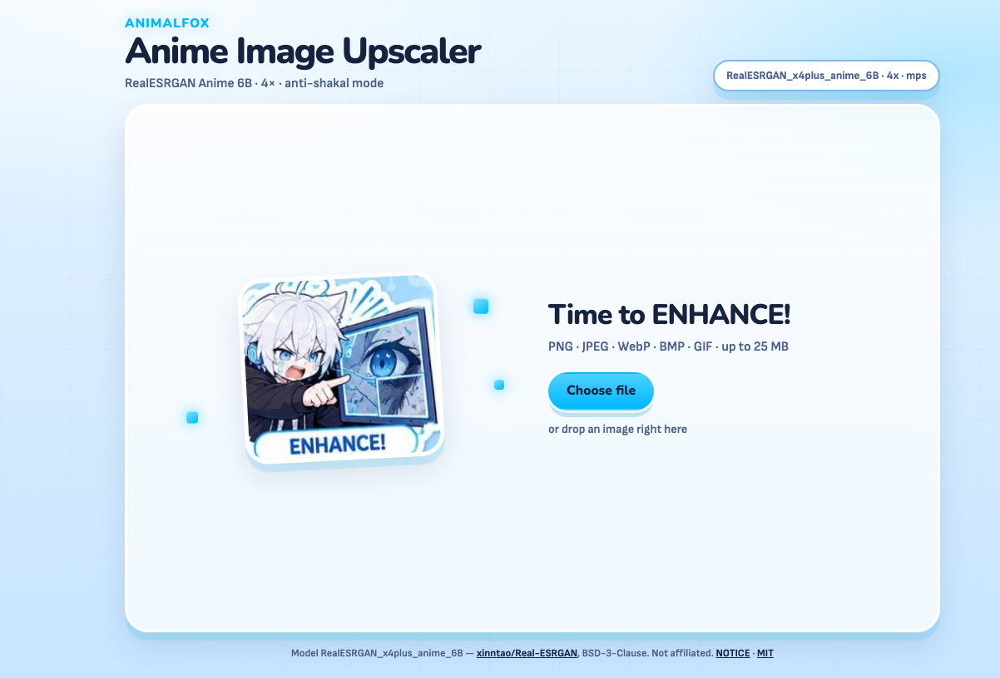

# Anime Image Upscaler

**Local 4× web UI for anime images**  
powered by [RealESRGAN_x4plus_anime_6B](https://openmodeldb.info/models/4x-realesrgan-x4plus-anime-6b)

[](LICENSE)


Drag in anime art, upscale it locally with Real-ESRGAN, and compare **before / after** on the same image.
Built around the **Animalfox** sticker aesthetic.


*Live upscale progress*

## Contents

- [Demo](#demo)
- [Features](#features)
- [Quick start](#quick-start)
- [Requirements](#requirements)
- [Project layout](#project-layout)
- [Credits](#credits)
- [License](#license)

## Demo

Web UI (English):



## Features

- **4× RealESRGAN Anime 6B** — model tuned for anime / illustration (weights included)
- **Drag & drop** upload (PNG, JPEG, WebP, BMP, GIF · up to 25 MB · max 4096px side)
- **Before / after slider** on the same canvas
- **Local-first** — runs on your machine (MPS / CUDA / CPU)
- **i18n** — English by default; Russian when the system locale is `ru*`
- **One-command lifecycle** — `make install` · `make up` · `make down`

## Quick start

```bash
make install
make up
```

Open the URL printed in the terminal (port is stored in `.port` after the first start).

```bash
make down
```

Model weights ship in the repo at `weights/RealESRGAN_x4plus_anime_6B.pth`
(~17 MB, BSD-3-Clause; see [NOTICE](NOTICE)).

## Requirements

- Python **3.12+**
- Make
- [uv](https://github.com/astral-sh/uv) (recommended) or `python3.12` + pip
- macOS / Linux — Apple Silicon uses MPS; otherwise CUDA or CPU
- ~2 GB free disk for the Python env (PyTorch) after `make install`

## Project layout

| Path | Purpose |
| --- | --- |
| `app/` | FastAPI app, UI, inference |
| `scripts/` | `install.sh` / `up.sh` / `down.sh` |
| `weights/` | Bundled Real-ESRGAN Anime 6B weights |
| `docs/assets/` | README media (kept in-repo) |
| `data/uploads`, `data/outputs` | temporary runtime files (gitignored) |

More development notes: [CONTRIBUTING.md](CONTRIBUTING.md).

## Credits

- Model: [xinntao/Real-ESRGAN](https://github.com/xinntao/Real-ESRGAN) — `RealESRGAN_x4plus_anime_6B` (BSD-3-Clause). See [NOTICE](NOTICE).
- Mascot & sticker art: **Animalfox**

## License

- Application code — [MIT](LICENSE)
- Bundled model weights — BSD-3-Clause ([NOTICE](NOTICE))

Security reports: [SECURITY.md](SECURITY.md) (not public issues).  
Community norms: [CODE_OF_CONDUCT.md](CODE_OF_CONDUCT.md).
